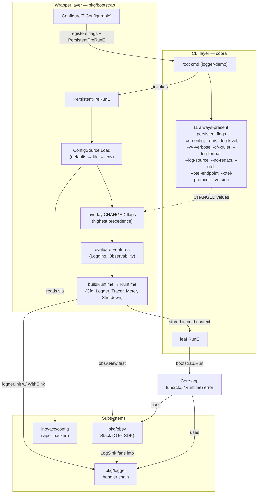
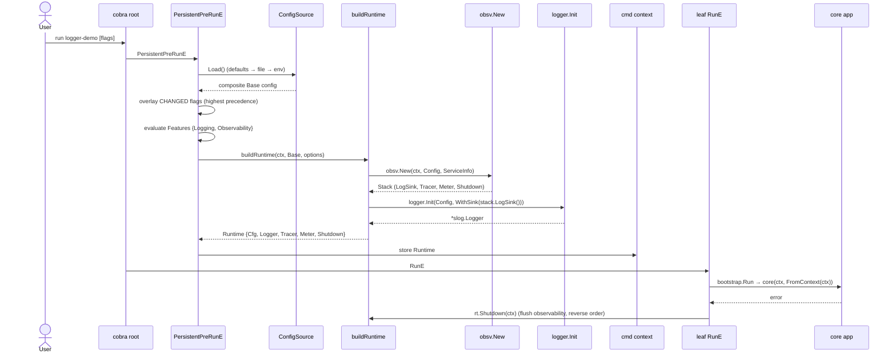
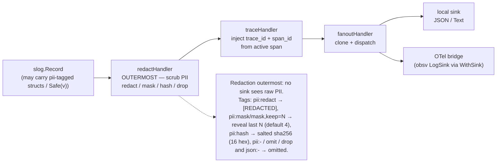
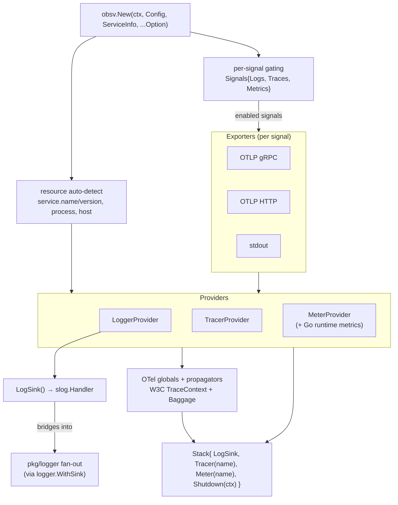
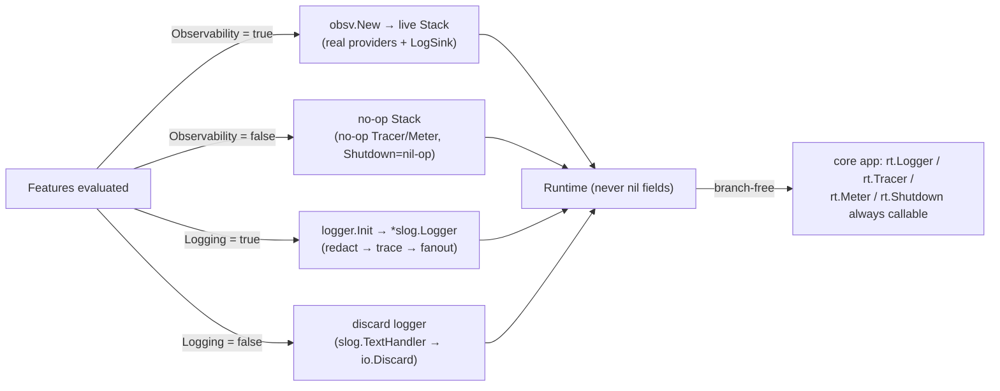

# Mantle Architecture

Mantle (`github.com/inovacc/mantle`) is a batteries-included Go application runtime
that wraps any binary — from its Cobra CLI down to its core logic — with
PII-redacting structured logging, full OpenTelemetry observability, and
feature-flagged unified config. The flow is always **cobra (entry) → bootstrap
(wrapper/runtime) → core app**.

> Module-path rename to `github.com/inovacc/mantle` is a pending follow-up; the
> brand "Mantle" is adopted in docs first while the import path stays
> `github.com/inovacc/mantle`.

The runtime is composed of three layered packages plus a reference binary:

| Package | Role | Dependency boundary |
|---------|------|---------------------|
| `pkg/logger` | Structured logging on `log/slog` with tag-driven PII redaction and trace correlation | stdlib + `otel/trace` (API only, **no SDK**) |
| `pkg/obsv` | Full OpenTelemetry bootstrap (logs + traces + metrics) | owns the OTel **SDK** deps |
| `pkg/bootstrap` | The cobra → wrapper → core runtime, config load, flag overlay, feature gating | owns `cobra` + `inovacc/config` |
| `cmd/logger` | Reference binary `logger-demo` proving the end-to-end wiring | composes the above |

---

## System Overview

This flowchart shows how the layers connect at startup. The CLI layer parses
flags, the wrapper layer (`bootstrap.Configure`) loads config and builds the
`Runtime`, the subsystems provide logging and observability, and the core app
receives a single `func(ctx, *Runtime) error` with everything it needs.

---

## Request/Boot Flow

The boot sequence is driven by Cobra's `PersistentPreRunE`, which runs before any
leaf command. Config is resolved with strict precedence (programmatic defaults →
file → env → changed flags), then observability is built **before** the logger so
its `LogSink()` can attach to the logger's fan-out. The assembled `Runtime` is
stored in the command context and retrieved by the leaf via `bootstrap.Run`.

---

## Logging Handler Chain

A log record passes through a fixed handler chain. **Redaction is the outermost
handler**, so no downstream sink — neither the local JSON/Text sink nor the OTel
bridge — ever observes raw PII. Trace correlation is injected next, then the
record fans out to all configured sinks.

The redactor resolves any `slog.LogValuer` (including `Safe(v)`) first, then walks
struct fields applying `pii` tags. Known limitation: top-level interface-only
structs are not auto-redacted unless wrapped with `Safe`, and a nested
`slog.LogValuer` inside a container is not resolved/redacted.

---

## Observability Stack

`obsv.New` builds a full OpenTelemetry `Stack` from a resource and per-signal
exporters. Each signal (logs, traces, metrics) is independently gated, exporters
are selectable (OTLP gRPC/HTTP or stdout), and the resulting providers are
installed as OTel globals alongside W3C TraceContext + Baggage propagators. The
`LogSink()` handler bridges OTel logs back into the Mantle logger's fan-out.

---

## Feature Gating

Subsystems are toggled by `Features{Logging, Observability}` resolved during boot.
A **disabled subsystem yields a fully no-op implementation, never `nil`** — `obsv`
returns a no-op `Stack` (no-op `Tracer`/`Meter` and a `Shutdown` that does
nothing), and `buildRuntime` falls back to no-op tracer/meter and a discard
logger. This keeps core application code branch-free: it can always call
`rt.Logger`, `rt.Tracer`, `rt.Meter`, and `rt.Shutdown` without nil checks.
Likewise, `FromContext` always returns a usable `Runtime` even when none was
stored.

### Architecture invariants

1. **Redaction is outermost** so no downstream sink ever sees raw PII.
2. **Import-graph purity** — `pkg/logger` = stdlib + `otel/trace` only; the OTel
   SDK lives only in `pkg/obsv`; `cobra` + `inovacc/config` live only in
   `pkg/bootstrap`. Enforced by `go list -deps` checks.
3. Flags are overlaid via a manual post-load pass (inovacc/config exposes no
   public pflag binding); defaults are applied programmatically via `DefaultBase`
   because the loader ignores `default:` tags.
4. **Composite config** — users squash-embed `bootstrap.Base`
   (`mapstructure:",squash" yaml:",inline"`).
5. `obsv` is built **before** the logger so its `LogSink` attaches to the logger
   fan-out; disabled subsystems yield no-op (never nil) so core code is
   branch-free.
